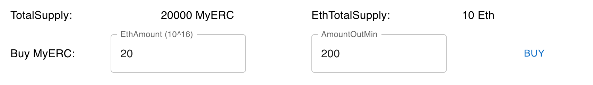

# ZJU-blockchain-course-2024

## 项目介绍

本项目为一个去中心化房屋购买系统，用户可以查看自己拥有的房屋列表，挂单出售自己的房屋，查看所有出售中的房产，查询一栋房产的主人及各种挂单信息，购买其他用户出售的房产，平台收取手续费等。

## 项目运行

### 合约部署

在 `constrast/hardhat.config.js` 中配置网络信息，在 `accounts` 处配置部署合约的账户信息。

随后运行 `npx hardhat run scripts/deploy.js --network ganache` 部署合约。

### 前端运行和部署

运行命令 `npm install` 下载必要的依赖。

将合约编译后的 `contracts/arifacts/contracts/*.sol` 文件夹下的 `BuyMyRoom.json` 和 `MyERC20.json` 文件复制到 `frontend/src/utils/abis` 文件夹下。

编辑 `frontend/src/utils/constract-addresses.json` 文件，填入两个合约部署的地址

运行命令 `npm start` 启动前端程序。

## 项目演示

首先我们可以从 ganache 中看到合约已经成功部署到 block 上

随后我们点击右上角的钱包按钮，进入用户信息界面，点击 `CONNECTED WALLET` 连接钱包

我们连接完成钱包后，使用 `CREATE MYERC20POOL` 按钮创建池子，会创建 20000myERC 和 10 ETH 进入流通，

结果如下图所示

随后我们进入 `MyHouses` 界面，合约的创建者会默认拥有两套初始的房子用于演示。

我们更改相关信息并上架

更改完成后，`Houses` 的页面即可看到上架的房子（原本为空）

此时我们切换另一个账号，进入用户信息界面，购买一部分 MyERC

随后我们进入 Houses 界面购买房屋，可以看到房屋出现在 MYHOUSES 中

自己的MyERC的值也相应减少

我们切换到另一个账号，可以看到房屋列表减少了一栋

同时收到了 200 MyERC 的钱和 2 MyERC 的手续费

